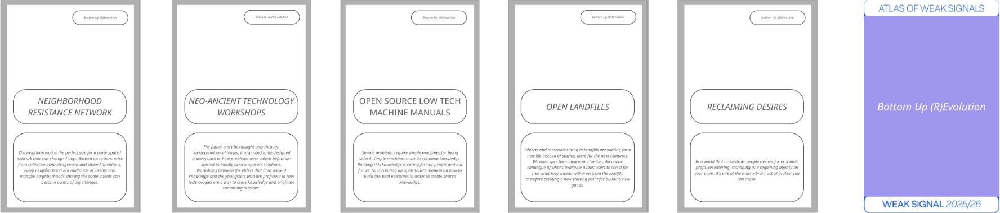

---
hide:
    - toc
---

## Atlas Of Weak Signals 2 ##

# Weak Signals from Term 1 #

# 5 New Triggers #

# 5 New Areas Of Opportunities #

# New Weak Signal Cluster #

# Reflections #

The Atlas Of Weak Signals has been a very interesting tool to me and I think that it could really help many creatives to find the right direction for their ideas. Having the possibility to find inspiration through a very intuitive game is something that's very relevant for me; the game is both simple and effective, making it something worth giving a try quite often. Speaking about myself for instance, I think that at times I know the topic I wanna work on and the general approach I wanna have around that topic, but I'm lacking that "lightbulb moment" of understanding where to tackle the subject from or what could be the best solution or application to generate from that subject. The Atlas cards somehow give you a very broad spectrum of very specifical field of applications, suggesting you actual and possible outcomes coming from your research.
I found all cards to be very useful but maybe the most interesting for me are probably the "areas of opportunities" and the "random triggers", because they help connecting intangible topics to tangible elements. Specifically the random triggers for me are very helpful because of their ability to link a research that is very broad and articulated and has been living in my head for a long time to a super specific output; this allows the discovery of applications that would have been much harder to think of without this tool. For instance I know that my favourite topics to work on are related to zero waste, recycling, new materials, low tech design and so on, but this subjects are very broad and thus sometimes can feel overwheling and difficult to tackle with an actual clear outcome. With the cards though, I had the feeling that identifying a solution or a possible outcome was easier and more fun, which are two very relevant advantages.
I still didn't use the cards much for my personal research because I already had somehow in my head what I wanted to do for the master's project, but I'm pretty sure I will get back to them many times in the future when I'll be looking for some inspiration or searching from some clarity in my head while having an idea that still needs direction.