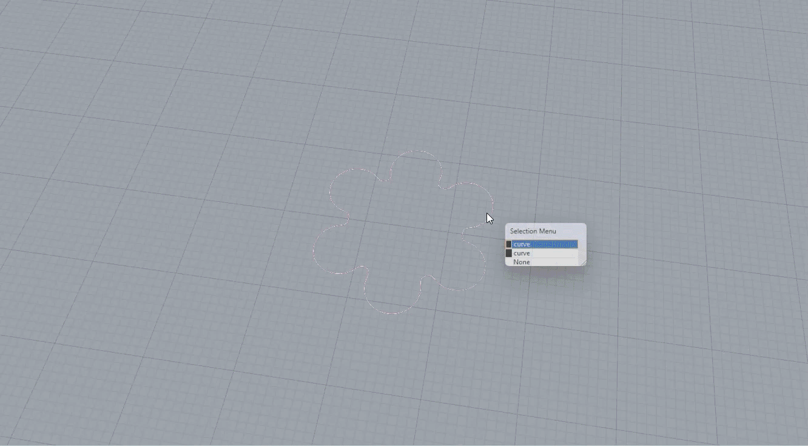
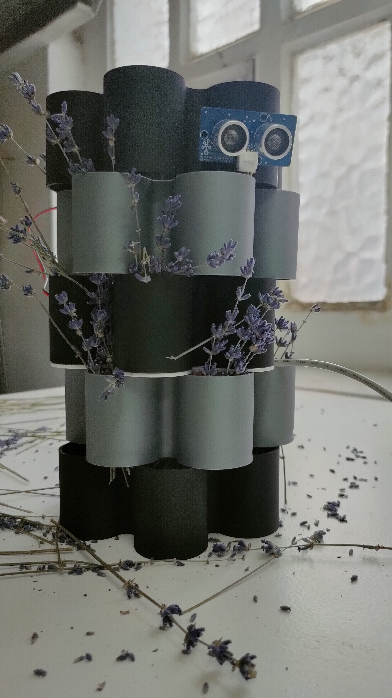
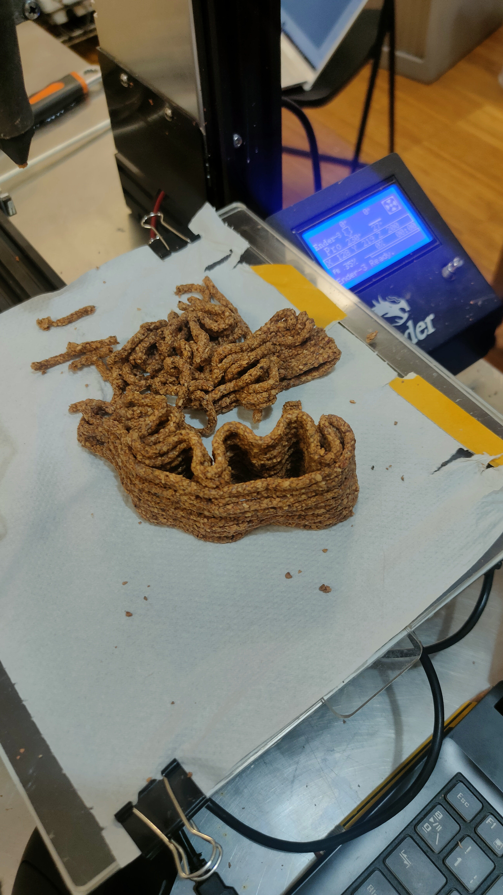

---
hide:
    - toc
--- 

**COGNITIVE ORGIES**

**Individual Post**

For the 2nd orgy, I teamed up again with Melissa, we enjoyed working together in the first orgy and our mutual interests made us continue working together also in this second intensive workshop.

As required by the brief, we had to develop the project establishing first the concept of intelligence, then develop a concept that would allow two intelligences of our choice to communicate. As both of us are always very interested in planet care and multispecies justice, we soon decided that one of the two intelligences would have been an "other species intelligence" as we wanted to give them the importance that they often don't receive much consideration by humans when it's time to design. We particularly decided to focus on pollinator being one of the two intelligences, with the other one being us, humans. We chose pollinators because of their importance in the planetary equilibrium and because of their endangered situation that they're facing nowadays with loss of habitat, especially in the city.
This time we were a bit more prepared in terms of organization, we already knew how the week was organized and we took sometime before to start thinking about our idea. Even if we started earlier, I still have to say that the concept definition is the phase that always requires us more time, maybe because we always want to choose an idea that solves a problem and we want to tick many boxes while defining it in order for us to be satified with the decision: I still have to think if this is a quality or a problem that we have, maybe for such a short time workshop is more of a problem. 

**Cognitive traces**

Throughout the four days, I have to say that we mantained quite a stable and coherent direction to what we decided to develop in the first day. We had one clear goal in mind and the development phase was mainly carried on acting on what we had in mind as a final outcome.
Since we believed a lot in the concept itself, we never changed direction in that sense, but a moment were our way of thinking changed was probably when we were arguing on which shape to create to build the actual artifact. We started considerating many different aesthetics, trying to develop some that would gave beauty and complexity to the project: so we went on 3d modeling artifacts made by the rotation of different layers, in order to have a twisted dynamic form and tried to join different shapes with eachother to have an outcome that was broadly including all the dimensions, but in the end we started noticing that this complex shapes were probably just dictated by our desire to make the object look beautiful, but were missing out a lot on the practical aspect, both in the actual realization of the artifcact and on the functionality of it. We 3d printed a trial of one of those shapes, but we noticed that for example creating the pockets for the plants with those designs, would have meant to add external vase-looking shapes that felt a bit unnatural and structurally problematic. While we were making all of this considerations, we stumbled across a clay 3d printed part in the hall of IAAC, the part was very simple and made by the multiple layers that were all the same shape, just rotated by 90 degrees every layer that was built on top of the other. THis rotation allowed for the creation of "natural" pockets because of the geometry itself, without needing to add any parts to the shape. We realized there that this type of approach was much simpler, and despite losing a bit of aesthetical features, also more helpful for the type of function that it would have need to enact. We had a bit of doubt and discussion but finally we decided to change and take inspiration from that shape, sacrificing aesthetic for function.

**Moral traces**

This time me and Melissa had more conflict compared to last time, both because of some situations that were intricated and for stress accumulated in the last day or so before the delivery. As I'll explain more in detail in the technical traces, choosing to work with 3d printed cork paste elonged enormously the time needed to obtain an artifact, and this has been a topic of discussion that we had for a couple of days, where I wanted to quit the process and try using another material or another technique while my teammate wanted to continue with it at all costs. On this topic we had quite some discussions even though in the end I stopped trying to impose my vision, and this tension accumulated kept complicating things and choices a little bit untill the end; it wasn't pleasant but this things sometimes happen when people need to work on a tight schedule so we took it with the right point of view and talked a bit aboout it also the days after. Another  moral traces regarding the decisions in this project I think was also deciding if to do a 3d printed version of the object or not: since me and Melissa care a lot about environmental topics, printing with plastic an object that would have served its function for a very small period of time was a bit controversial. At first we didn't wanna do it as we were also thinking that we would have been able to print the artifact fully in cork, but when reality started to hit and we realised it would have been impossible to have a finite cork object we decided that for the sake of the quick workshop prototyping printing would have been justified to print so we went for it. As for what regards the use of AI, it wasn't an issue or a matter of debate as we just used it to do some research about the problems of pollinators in the city and the possible things or design choice that would have helped them to thrive and more practically to find out recipies and variation of recipies for cork based material to 3d print.

**Technical / process traces** 

This time we found the idea earlier than last time but what we lost a lot of time with has been the process of relization: we decided to choose 3d printing cork both because it had some features that we needed for the project (lightness, impermeability, thermal cooling) and because we wanted to experiment with it since we felt more confident after we printed clay in the last orgy. I think we really underestimate the complexity of 3d printing this material, especially with the machine we had available; it took us almost a morning to set up the machine by ourselves (even if we felt like we remembered all the steps some complication took place) and then started the struggle with the material itself. Even though we managed to reach the right consistency of the cork based paste and even though we did tested the extrusion capabilty of it with just the compressor and the container, what really gave us immense problems was the capacity of the material to stick to the printing plate for the first layer and to itself from the second layer on. 
We couldn't find a way for it to stick properly to any surface, we tried the plastic plate that was made for the printer, we tried covering it with oven paper, with wrapping plastic, with paper towel, with normal paper, we tried substituing the plate with a wood piece, none of this allowed us to obtained a smooth printing experience, we always had to press the part that was just being extruded with a wood piece for it to slightly stick on the palte or previous layer, and this was super time consuming.

Another technical trace surely happened again when we where printing: after a lot of trials and errors, it looked like we got a little bit the hand on the process as we were pressing the freshly extruded part right after extrusion in order to make it stick to the previous level properly. We completed one piece that would have been nice to show because it was showcasing the possibilities in terms of geometry and structural integrity. The print would have still continued going for some layers but we were satisfied with the amount of layers we already had and a bit scared that adding more layers would make the structure instable so we decided to stop the print in order to put aside a kind of finite part. 

When we stopped the print, for whatever reason the nozzle started to go down the z-axis and crushed part of the artifact, panicking we tried to lift it back up with the software but probably pressed the wrong direction and the printer dragged the nozzle all the way through the x-axis, destroying almost all of the object that we had developed.

 It was quite of a paintful moment since we had spent already a lot of time printing that part and the deadline was getting closer, so we decided to start again but this time to print it manually in order to not risking having again this problem and haveing at least a finite layer to show. Funnily in a project working with communication between two intelligences, we realized at our own damage, that the communication between human intelligence and the machines has still a long way to go.
