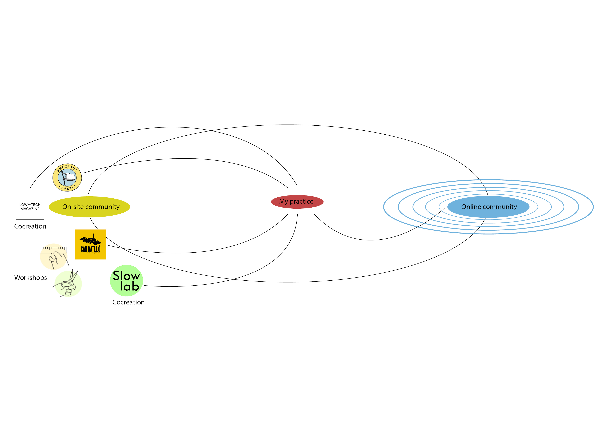

---
hide:
    - toc
--- 

#Situated Design Practices#

In the days of situated design practices, we were exposed to many different stimuli in many situations that were very very different between each other. We’ve been strolling from one of the most technological site in the city, the Barcelona supercomputing center, to a completely different scenario like Cal Negre. We’ve been hearing talks from an interdisciplinary artist that sees her body as the most important tool to explore to a journalist whose focus is about sheding light on migration and mobility and everything that revolves around it. As it felt a bit complex to connect all of this different people with different stories and different practices I think what I can take away from this is probably the observation of this differences and so the need for a decision and take of a strong position.
The alumni at the supercomputing center had a strong interest in technological application which she pursued during the master and which she tried to turn into a job after graduating and by pushing even over her limits she succeeded and was now starting this journey in the center.

The duo from Cal Negre moved from the city to submerge in their practice and found an amazing place both to live and work, that allowed them to develop their practice. They wanted to work with element given from nature and they took the decision to live outside from the city to be in touch with the same nature that was giving them the clay. Mercedes had to fight judgment, discomfort and heavy attentions to develop her practice and be able to transparently film herself in her room and take who she is in her room also outside of it. 
Hibai didn’t look the other way and despite being a lawyer, he decided that was important to stand for the others’ rights and bring those stories to the surface for others to see it.
All of this people situated themselves in a context, phisycal or digital and submerged themselves being strongly tied to that context. I guess the topic of obsession that we encountered also the past trimester is always coming back when meeting people that are deeply commited and strongly believe in what they’re doing.
The theme of obsession stuck with me since we had the talk with the guy that tried to “become a goat” and more and more I’m understanding that it’s truly what differentiate people that fool around with whatever concept and people who will surely find a way to do what they decided to do.

The practices that resonated with me the most were surely the one of Cal Negre because of my inclination of making things with my hands, practice that I’m relatively new at but that I am really enjoying and keep on exploring. It resonated with me beacuse I could imagine myself in the future living in a similar place with some likeminded people working on my practice. I visualized this and it actually felt really nice in my head, I hope one day I could say that that became my reality.
If my practice is then linked to physical objects, object are linked to materials and materials are linked to places. 

I started thinking where would I see myself working phisically and I think that Barcelona has a lot to offer compared to other places. I’ve already been visiting a couple of times Akasha Hub in Clot area, specifically to meet Kris from Low Tech Magazine and Audrey from Slow Lab, which is also an MDEF alumni.
It felt pretty amazing to be there and I could see myself working there in the lab sharing knowledge, doubts, curiosity and ideas with the other people revolving around the coworking. Another place that came to my mind is Can Battlo, where a lot of workshops are held and where the community aspect is deeply rooted. It’s in this type of places that I believe that design practices can be cultivated, shared and improved thanks to the member of the community, from the most specialized to the most distant person.  Last but not least I then thought about the fact that even if a product is physical, nowadays can be communicated and spread all over the world digitally. The online community of makers is huge and always growing, and that’s where open source projects could take life and improve day by day, creating an intangible but hearthfelt community that could be there for you without you even knowing anyone. I am actually planning to make my current project opensource when it will be ready, to be able to reach most people possible and I am very curious to see what type of outcomes could that generate and what new project it could spark. 

