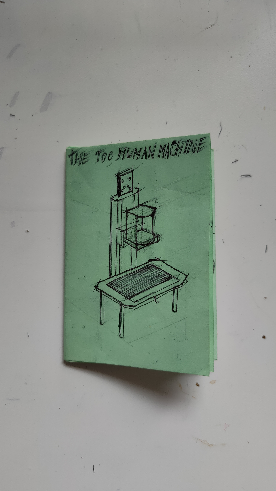
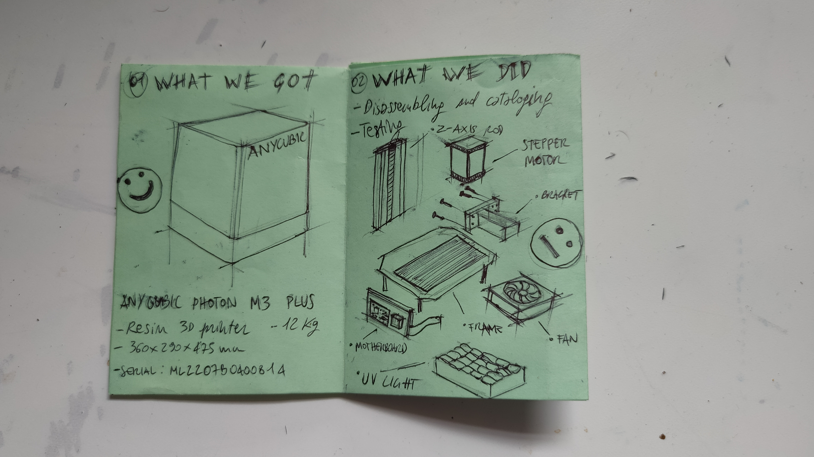
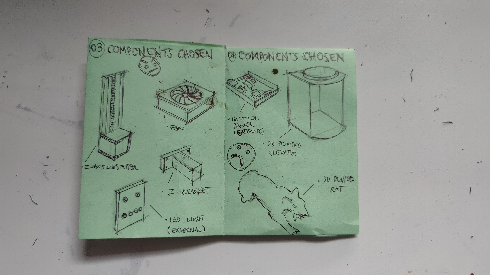
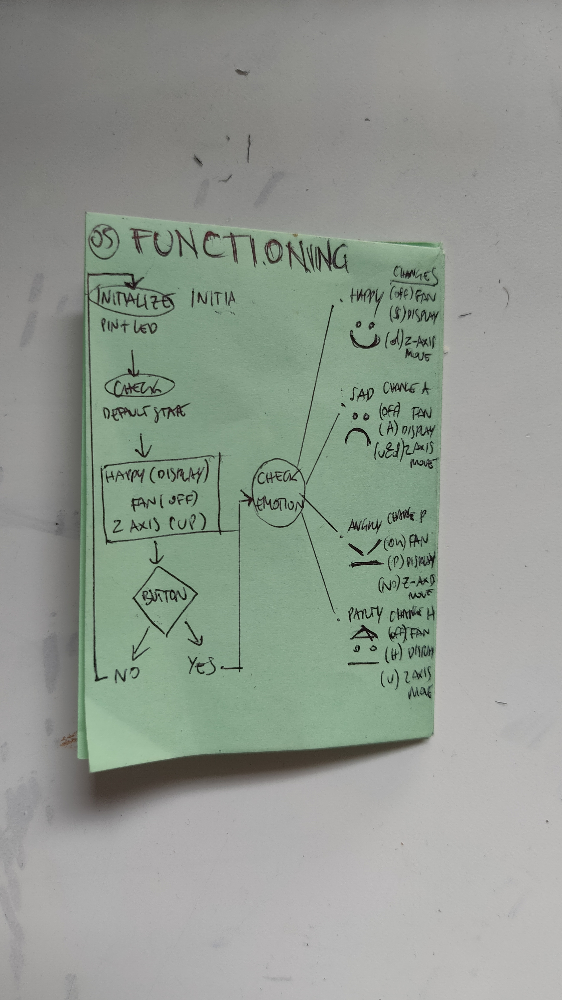
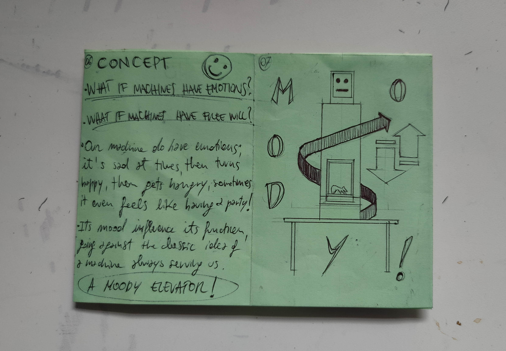
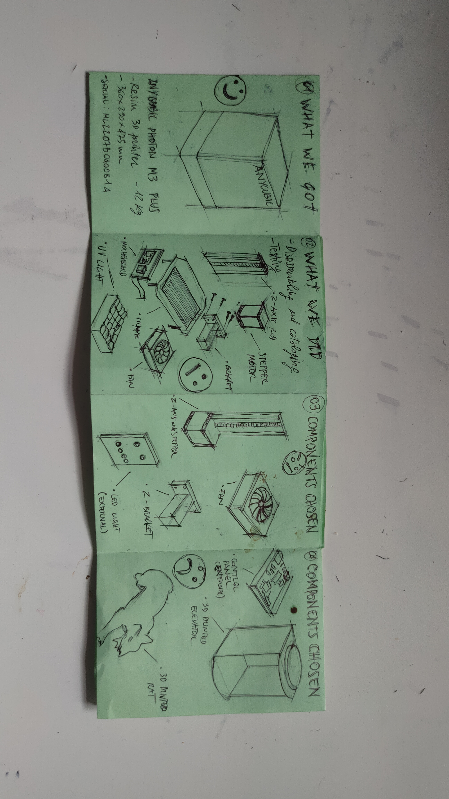
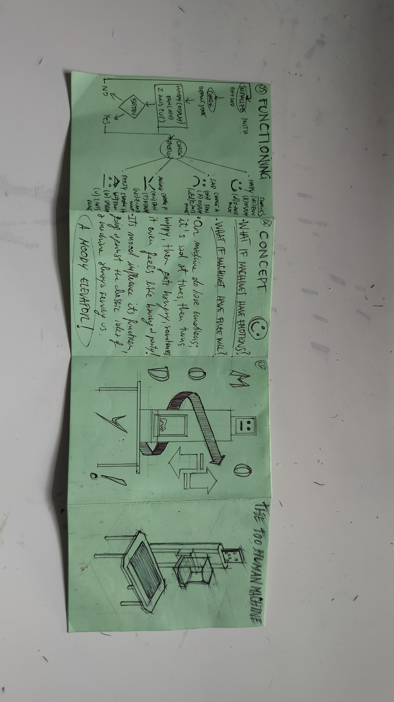

---
hide:
    - toc
---

## The machine paradox ##

After dismantling and analyzing the parts of the 3d printer in the first week, on the second one we started building a new machine from the parts we obtained. 
The brief we were given was about bulding a "useless machine": we had to build a machine that was functioning but not actually doing something relevant, this choice was made in order to take away the pressure of solving a problem, to be able to focus more on the functioning of the components only. 

Here's the link to the presentation of the machine we developed in my group of work: https://docs.google.com/presentation/d/11_xS_0ml6C-zfL2LV7qfNxleFGUzB8D4UYblDZbepPM/edit?usp=sharing

Here's the link to the video we created to communicate the story: https://drive.google.com/file/d/1nTU3J4Txr2c1WM4LEtSBieTEbGRmzlj4/view?usp=sharing

## Personal reflections ##

This two weeks have been very intense and very interesting at the same time. It was the first time for me approaching the inside of the machines this close: I've been trying to fix minor issues in some of my objects but often finding myself giving up because of the fear to compromise the machines even more. Removing this fear through disassembling an already broken and discarded object was amazing for me, beacuse it gave me the freedom to explore without worrying to damage something valuable. 
I loved both the disassembly and the creation part, obviously having the chance to be helped by such prepared professional made the learning process much smoother. 
Each week made me feel something different: during the first week I was suprised by the fact that disassembly a 3d printer is actually not as hard as I would have thought, the components were not hundreds as I was imagining but more like dozens, the electronical parts were not nearly as many as I thought and their functioning was way simpler than I was expecting. It was very nice to find out all of this because before starting the week I was afraid that taking a part such a machine would have been a big struggle, while in the end was kind of a pleasant process of learning and discovery. So I guess for the first week the take can be summarized in a sentence that often comes useful when I tackle challanges that seem very difficult: "How do you eat an elephant? A bite at a time".That's how we approached the task and that's what allowed us to succeed in the end.
The fact that dismantling this machine was not as hard as I expected also made me reflect on planned obsolescence. In the last 10-20 years companies producing machine are somehow making it harder and harder to have accessibility to disassemble their parts in order to fix the malfunctioning component. It's in their interest to make you feel like if a component is not working it's just better to buy a whole new and updated machine that fixing the old one. I feel like if everybody had a little knowledge about the machines we deal with every day, we wouldn't see all this consume of new and often unnecessary products that we see nowadays.

The second week was different but maybe even more fun because we got to put our own ideas into the process; putting all the element to work together was a lot of fun and the seeing the final object working exactly to the commands we gave was very satisfying and rewarded us of all the trial we had to do. 
Not having to worry about building a useful machine really took away that pressure of trying to give meaning to the object and allowed us to focus on the components and their functioning which were the most import things; it was very nice approaching to real coding and electronics for the very first time and I feel like this will give me the confidence to explore it more in the future without fearing to climb this big mountain of complexity. 
What I generally really appreciated and will take home with me of this two weeks is that a world that I thought was insanely complex is actually possible to understand with the right attitude and the right support from the outside. I am sure that in developing my master project I'll take advantage of what we learnt in this days and that this type of technologies will help me bring more values to my idea. I'm passionate about low-tech solutions because I believe that we don't need an overcomplicated and overtechnological solution to every problem that we encounter and I feel like what I learnt in this course can be the first step towards experimenting new solutions to go towards this direction. 

## Zine ##

<iframe 
  width="100%" 
  height="315" 
  src="https://www.youtube.com/embed/3dQWV0Ea89k" 
  title="YouTube video player" 
  frameborder="0" 
  allow="accelerometer; autoplay; clipboard-write; encrypted-media; gyroscope; picture-in-picture; web-share" 
  allowfullscreen>
</iframe>

