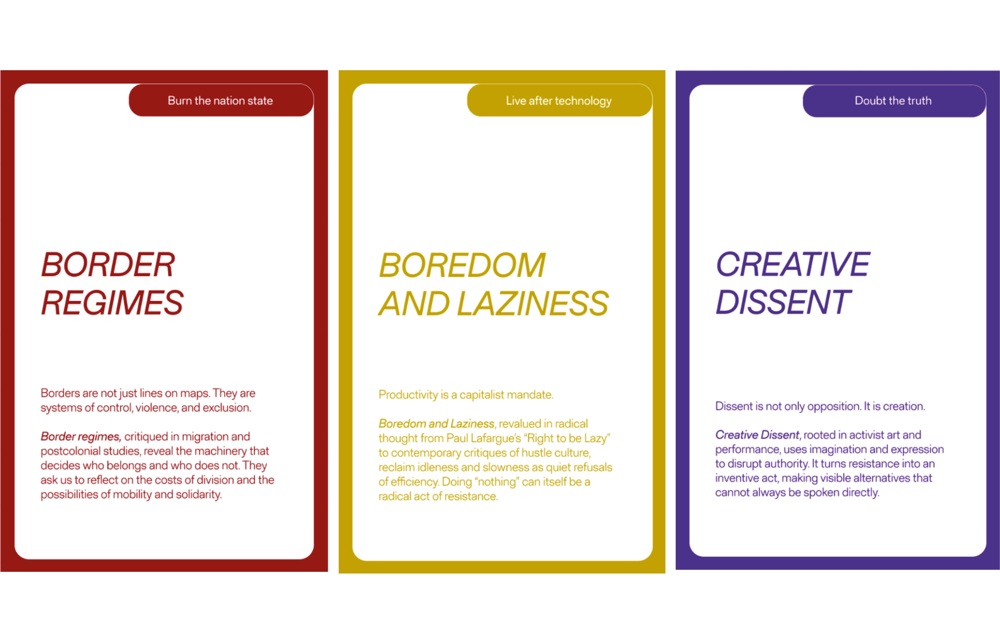
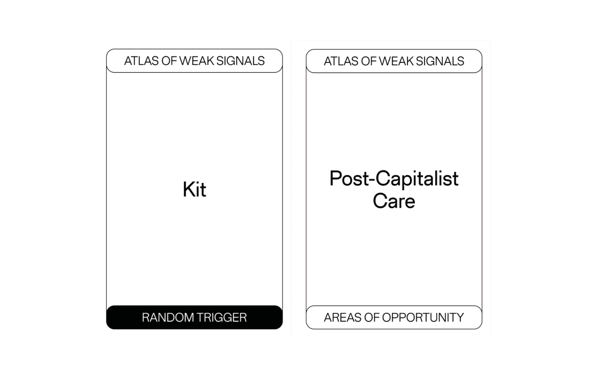
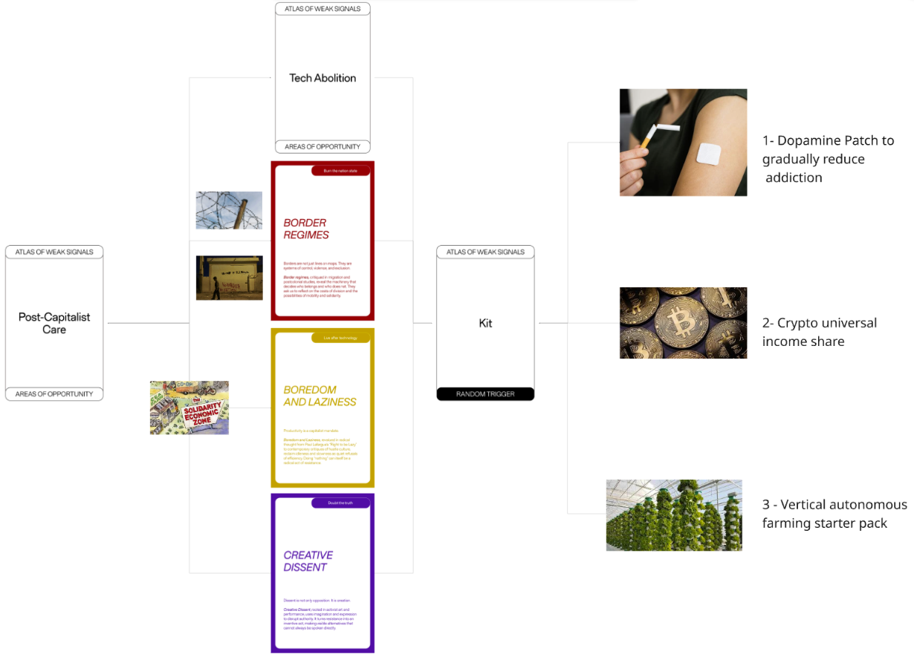

---
hide:
    - toc
---

## Atlas of Weak Signals ##

# Cards given #

# New Card Ideated From Us #

<iframe 
  width="100%" 
  height="315" 
  src="https://www.youtube.com/embed/0VJFyfiYXVs" 
  title="YouTube video player" 
  frameborder="0" 
  allow="accelerometer; autoplay; clipboard-write; encrypted-media; gyroscope; picture-in-picture; web-share" 
  allowfullscreen>
</iframe>

## Group Game (09.12.25) ##

The more I play with the cards, the more I realize how useful and inspiring this game is. I believe that finding the field of intervention is one of the hardest things to deal with when designing, but every time I played or interacted with the cards I felt very inspired: lots of ideas, some crazier, some more feasible, came to my mind from the intersection of multiple cards and sparkled discussions, interior ones or shared with the group.
For this specific time playing in group, we chose the cards we thought could be more interesting and connected between each other, going towards where we saw a good potential dicrection. 

# Cards Chosen #

We started our whole thought process from the *Post Capitalist Care* card because we all agreed about it being the most meaningful. We then combined the three cards of *Border Regimes*, *Boredom and Laziness* and *Creative Dissent* as subtopics to be linked to the main one in order to give us more fields of intervention under the main challange to tackle: *Post Capitalism Care*. All of this elements has then been funneled into the random trigger: a *Kit*. We propose a kit made to solve the topics tackled that is supposed to be given to citizens. Said kit it's made of three elements: 

1- Dopamine patches designed to gradually reduce dopamine addition like the one used to quit smoking 
2- Some shares of a special cryptocurrency specifically built to work as a universal income. with those currencies you could buy objects that are needed to live off grid, outside of the old capitalist paradigm. 
3- A vertical farming pack with all the elements to build your own farm in order to grow your own food and continuing building an off grid life.

# Scheme #

## Connecting weak signals to my research area (06.01.26) ## 

WS01- * How often our decisions serve not just ourselves, but the greater good of society and the world's future? *

This is a question that I often ask myself and a topic that I frequently think of when designing. In my research area developed during this three months this type of reasoning has been always considered underneath my actions, always present as a hidden structure holding all the elements of a bigger system together. 

WS02- * The price of exploitation. [...] The blindest eyes are the ones that don't want to see. The profit is the focus point, what's underneath it can be avoided if you don't look down. Until the ground sinks under your feet. *

This was one of my pin referring to a part of the exhibition at Palau Victoria Eugenia. Particularly it was referring to the extractivism in the so called "Spanish Sahara" in  the 70s, where a huge 100 km conveyor belt was constructed to transport rocks in order to obtain minerals. During this transport the strong winds transported away toxic dust like Uranium, phoshoric acid gypsum and Thorium from the rocks being moved and started contaminating a big area. 
In my research area I'm trying to develop ideas that go in the complete opposite direction of this way of thinking, putting the planet ahead of the individual's profit.

WS03- *How to critical think without believing that we're fucked*

Sometimes it's hard to deal with the kind of topics like the one I'm working with and not lose hope about the future. You might put a lot of effort during months in developing something that goes towards the right direction and one afternoon you could read on the news that a multimillionaire did something that your actions probably could not compensate even if you repeated them for a whole lifetime. I guess that's another challange for the area I'm working on, not only for myself, but also for the broader public that I would like to involve in order to start a change: to always know that every small step in the right direction is important and even more relevant if shared by an always increasing amount of people, to believe that the result may not be visible in the immediate or kinda close future but that what you're doing is and will be relevant. 

WS04- * The world is your playground. When spaces and more in general solutions to problems are not provided, the only way to solve those issues is to start an action from the bottom trough the mutual help of communities. *
individualism
This was another one of my pins in the exhibition and was inspired by a picture of two guys climbing in a city tunnel that they had previously arranged to be a climbing walls with some tools like metal rings placed into the concrete and more. I find this to be somehow connected to my project because in my exploration of new practices of consumption I've always considered the community as a very relevant and fundamental part of the change; trying to invert such a rooted tendency in the society cannot be done by just one individual, but it needs to be shared, supported and believed in by many. Communities, apart from being a group of people, share together more than individuality, but a common care about the space they inhabit, about the people that gravitate around it, about the activities that takes place in it and much more, that's why they're so relevant to me and to the research.

WS05- * Man as both a creator and a destroyer *

I resonated a lot with this pin, given that this concept is something I always think about: humans are the only species so intelligent to be able to destroy themselves without noticing. We're the living paradox of a species that has been able to progress immensely in every field but that it's going against its own good because of greed and egoism. Endangering our own possibility to thrive destroying the environment that has so gently hosted us for thousands of years is something almost impossible to believe in, yet is truly happening under the eyes of everybody. In my research I'm trying to generate alternative futures where the preservation of our environment is not a periferical optional thing, but the most important requirement to ensure ourselves and other species a future.