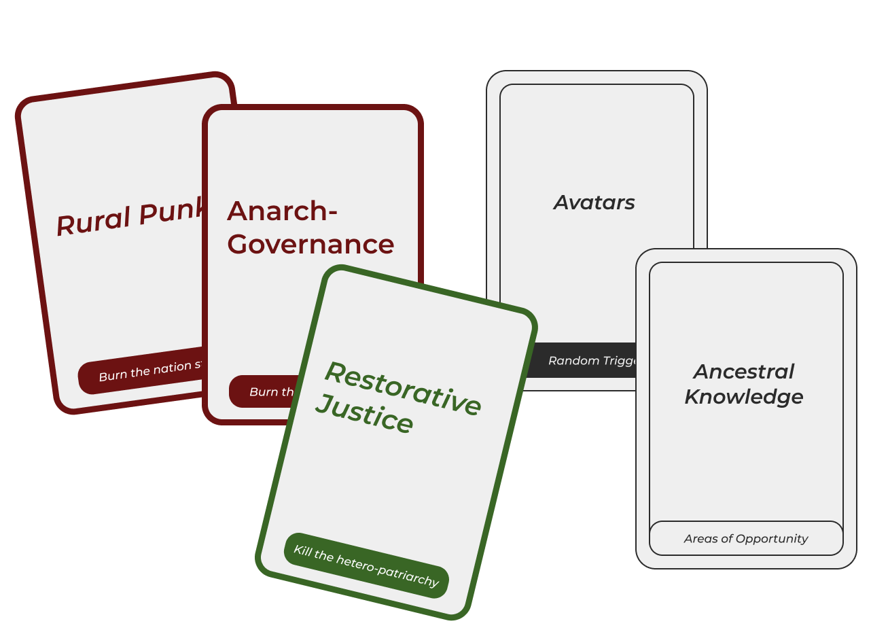
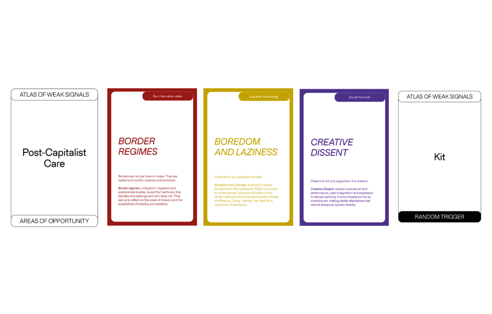
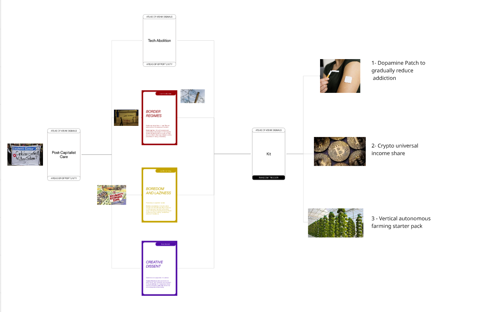

---
hide:
    - toc
---

## Atlas of Weak Signals ##

# Cards given #

# New Card Ideated From Us #

<iframe 
  width="100%" 
  height="315" 
  src="https://www.youtube.com/embed/0VJFyfiYXVs" 
  title="YouTube video player" 
  frameborder="0" 
  allow="accelerometer; autoplay; clipboard-write; encrypted-media; gyroscope; picture-in-picture; web-share" 
  allowfullscreen>
</iframe>

# Group Game (09.12.25) #

The more I play with the cards, the more I realize how useful and inspiring this game is. I believe that finding the field of intervention is one of the hardest things to deal with when designing, but every time I played or interacted with the cards I felt very inspired: lots of ideas, some crazier, some more feasible, came to my mind from the intersection of multiple cards and sparkled discussions, interior ones or shared with the group.
For this specific time playing in group, we chose the cards we thought could be more interesting and connected between each other, going towards where we saw a good potential dicrection. We ended up 