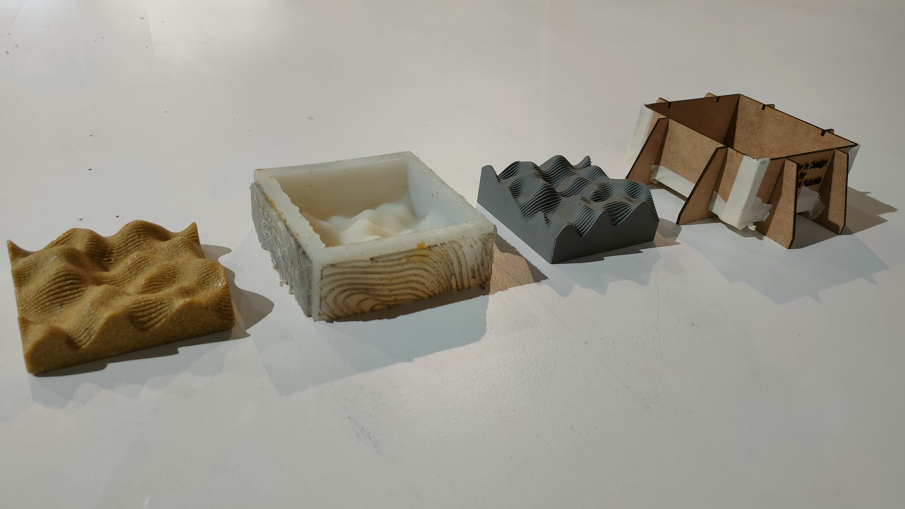
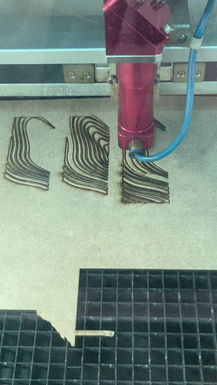
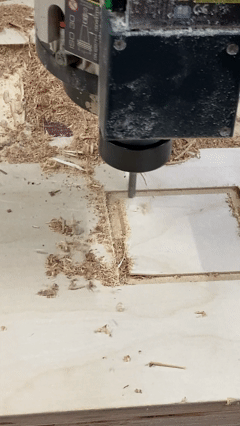
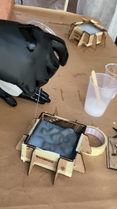
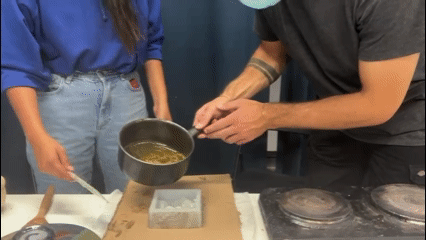
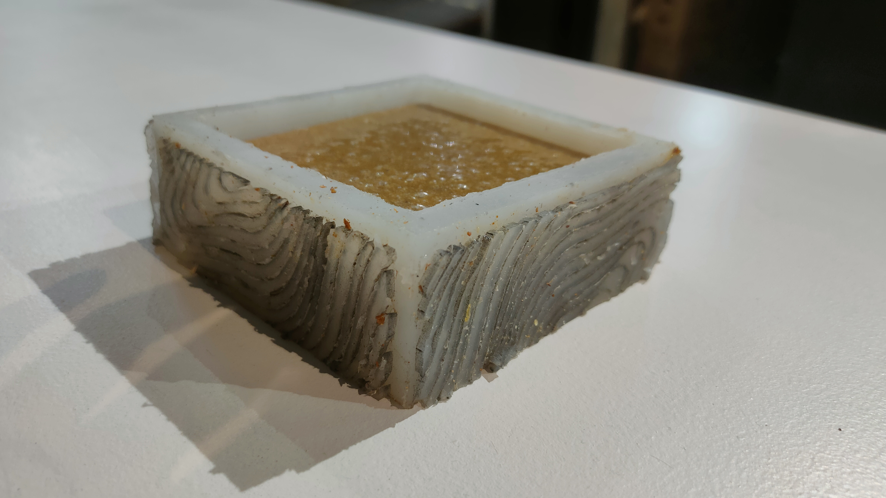
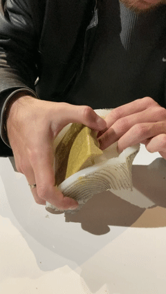
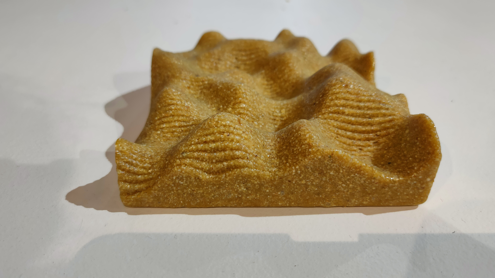
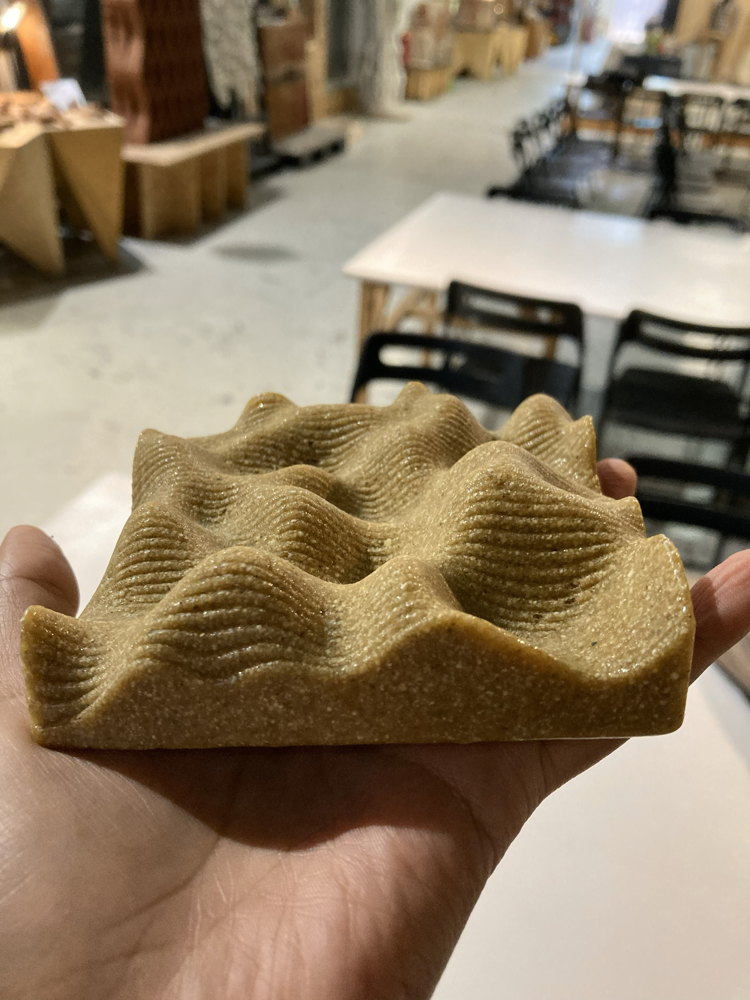

---
hide:
    - toc
---

# Fundamentals For Future Makers #

# Design process #

## Laser Cutting ##

The first step to take in order to obtain the final artifact, was to work with laser cutting to get a box from mdf panels. We were given the outer walls but we designed the inside walls with a geometric pattern with a repeatedly increasing curve. Later on we would have discovered that this wasn't the best pattern in order to take off the silicone mold from the walls as it got quite stuck to the walls; nonetheless with quite some work we managed to do it.

|  | Prima riga di testo che sta a destra della GIF. 
Seconda riga di testo che continua accanto all’immagine. 
Terza riga di testo, sempre nella stessa colonna.  
Nuovo paragrafo, ancora allineato all’immagine. |
|---|---|

| SINISTRA | DESTRA che continua qui ancora qui e ancora qui |
|---|---|

<!DOCTYPE html>
<html lang="it">
<head>
  <meta charset="UTF-8">
  <title>GIF + Testo</title>
  
</head>
<body>

  

  

    Questo paragrafo di testo scorre lungo tutto il lato destro
    dell’immagine. Può essere lungo quanto vuoi e continuerà
    automaticamente ad andare a capo mantenendosi affiancato
    alla GIF.  

    Qui puoi descrivere il processo di laser cutting, i materiali,
    il concept del progetto, le fasi di produzione, ecc.
  

</body>
</html>

<!DOCTYPE html>
<html>
<body>
  
</body>
</html>

## 3d Printing ##

We then created a 3d model shape that would be the actual shape of the final biomaterial artifact. Due to the complexity of this geometry, Rhino alone was insufficient, so we used Grasshopper to generate and control the layered form. The final piece was printed using Bamboo Studio as the software to communicate with the printers. This was one of our favorite stages of the process, as it aligned with our curiosity about designing for mold-making applications.

The result was pretty accurate and similar in reality to the 3d model, overall the process was super smooth.

## CNC ##

In this exercise, we were asked to create a hollow square as a placeholder for a final object. To maintain conceptual continuity with the previous steps, we integrated the mountain shape into the CNC-milled design. We prepared the toolpaths using RhinoCAM. 

## Silicon Mold ##

We placed the 3d printed part inside the mdf box and poured liquid silicone in it to obtain the negative shape of the finally desired artifact. Initially, we were concerned that the mold would not capture the finer details of the terrain. However, we learned that silicone is highly effective at reproducing small-scale details. The final mold successfully and accurately reflected the layered mountain geometry from the 3D print.

## Biomaterial artifact ##

Finally we poured the biomaterial mixture into the silicone mold to obtain the final object; we selected a resin-and-wax-based recipe intended to produce a hard piece. Although we correctly scaled up the quantities from a small-scale recipe, our first result did not meet expectations: the material remained sticky and lacked structural solidity. Cleaning the mold afterward was particularly difficult.
To address this, we conducted several small-scale tests to better understand the behavior of the material.

Through experimentation, we learned how to adapt the recipe for larger volumes. The filler (we used shrimp shells) played a crucial role in providing structural integrity, and although most ingredients were scaled proportionally, the alcohol—which dissolves the resin—needed to be increased only slightly, as excessive amounts made the mixture too liquid. Additionally, allowing the mixture to cool slightly before pouring helped the ingredients integrate more effectively.

