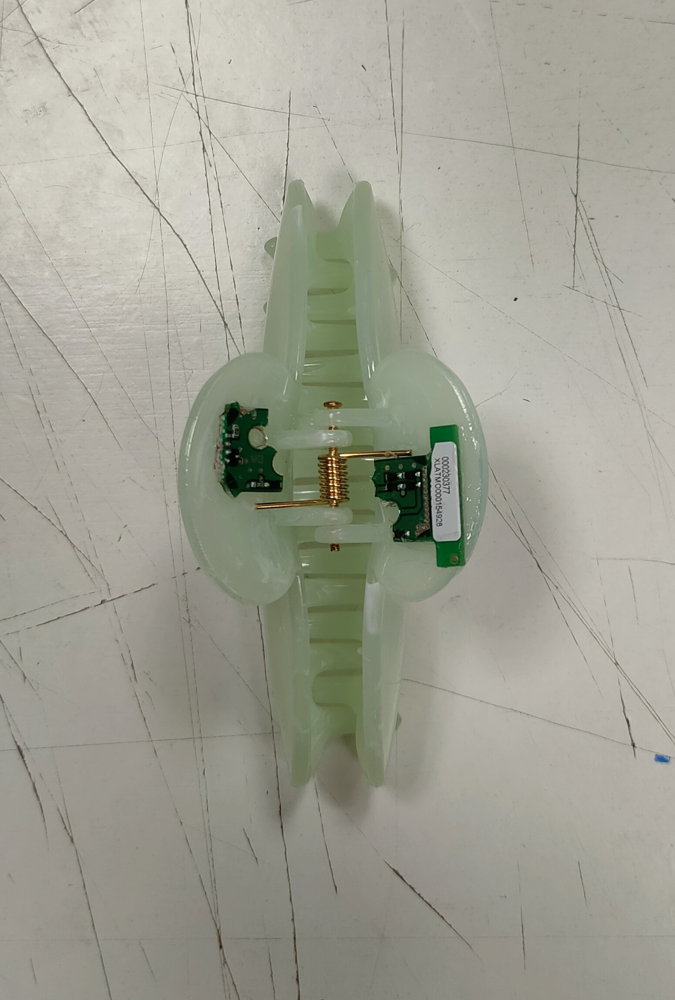
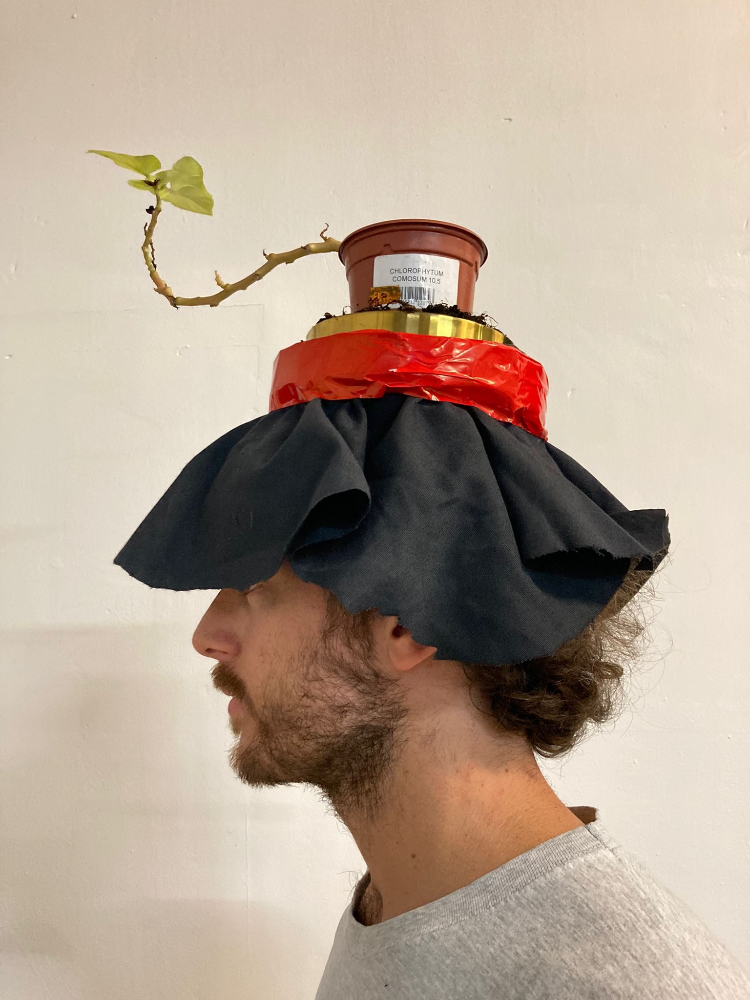
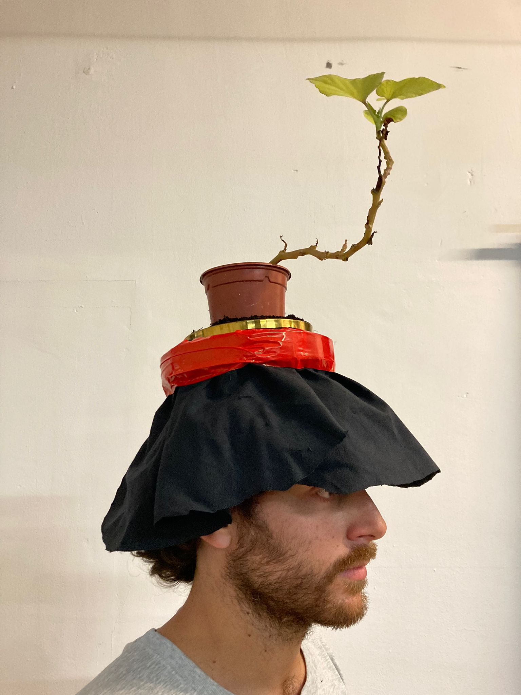

---
hide:
    - toc
---

# **Living with your own ideas**

**Day 01/ "To become the best version of myself"**

*To become the best version of myself is to help the others*

I approached the question "what is it to be the best version of myself?" trying to think differently, and I came to the reflection that to be the best version of myself for me is to help the others out. That's why I prototyped Backsense and Necksafe, two objects that are meant to increase the security at night, specially for women that may unfortunately face dangerous situation at night.

**01/BACKSENSE**

Backsense is a hair clip that with embedded technology components is able to detect presence within a range of 10-15 meters. By being placed on the back of the head, the object function as an eye on the back: in case the infrared rays detect human presence within the said range, the object will vibrate, alerting the user, who can check his surroundings to swee if a danger is coming or not. A gps is also embedded inside the clip, allowing a third person to know the location of the user in case of danger, as well as an emergency button in order to alert a police station.

<iframe width="100%" height="315" src="https://www.youtube.com/embed/BvNJNM0Esbg" frameborder="0" allowfullscreen></iframe>

**02/NECKSAFE**

Necksafe is a necklace that increases safety at night, being equipped with many functions. The gps combined with a camera get activated by entering in emergency mode and another button activates the pepper spray function to neutralize the aggressor. 

<iframe 
  width="100%" 
  height="315" 
  src="https://www.youtube.com/embed/5ilT44v0DwA" 
  title="YouTube video player" 
  frameborder="0" 
  allow="accelerometer; autoplay; clipboard-write; encrypted-media; gyroscope; picture-in-picture; web-share" 
  allowfullscreen>
</iframe>

**Day 02/ "To become something else"**

*To become a medium for pollinators*

In deciding my prosthesis following the statement "to become something else", I asked myself how we as human species can collaborate to live in symbiosis with other species, trying to achieve a perfect balance where we give to other species just as much as we take from them. I immediately thought about the pollinators, their crucial importance for our ecosystem and the fact that they're being endangered by the humans' activities. Thus I decided to design a head prothesis that would be able to host pollinators' favourite plants like lavander, rosemary, calendula and so on. By wearing this prosthesis, humans themselves would be a space for pollinators to thrive, gently serving them as much as they serve us.

**Day 03/ "How do I want to be perceived?"**

*To only reveal what I want, to not be perceived, to be fully perceived*

Being perceived by the others is an experience that we all go through, but how does that makes us feel? Depending on certain factors, being observed generate in us feelings that might change completely from a situation to another. From a space to another one, from the presence of certain persons to others, from a mood to a different one, the way I want to be perceived varies a lot. That's what I wanted to communicate while performing during the 45 minutes I've acted as somebody being followed by an unknown investigator from my class; I decided to use three different objects to represent my ideas, one every 15 minutes. 

*To only reveal what I want*

 At first I created a partial shield that was covering my face with a net: there are times where I want to show only the parts of me that I feel like allowing the others to see and nothing more, I'm the one who decides what they can see and what they can't, I have control over my image and how this can be perceived, I select the parts of myself, aesthetic or internal, that people can experience.

*To not be perceived*

There are times where showing myself just doesn't feel right, and in a the world of today it's hard to take a position, stand for yourself and decide that you're not gonna share your image, being it digital or physical. But firmly denying the share of ourselves is as hard as it is important for our wellbeing, being able to hide and decide to not show any part of us is part of taking care of ourselves.

*To be fully perceived*

Finally, to act the last chapter of my performance, I took a metal made object and use it to reflect the sun on my face, to fully let the others see me. Those are the times I fully wanna be perceived, where I allow myself to be seen in all my details, in all my shades, in my vulnerability and in my strength. That's when I embrace being part of a bigger ensamble and allow myself to transparently share my image. 

<iframe 
  width="315" 
  height="560" 
  src="https://youtube.com/shorts/oU1YP47pvT8?feature=share" 
  title="YouTube video player" 
  frameborder="0" 
  allow="accelerometer; autoplay; clipboard-write; encrypted-media; gyroscope; picture-in-picture; web-share" 
  allowfullscreen>
</iframe>
